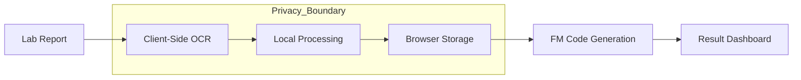

# ForMen Lab Report Explainer
### Clinically Precise interpretation of Semen Analysis Reports — Powered by WHO 2021 (6th Ed.)

A premium, private-by-design interpretative tool that translates complex fertility parameters into actionable, plain-English insights. Built for precision, speed, and absolute user privacy.

---

## 🏛️ Clinical Foundation

Unlike generic health trackers, this system implements a rigid rule engine mapped directly against the **WHO Laboratory Manual for the Examination and Processing of Human Semen (6th Edition, 2021)**.

- **Primary Indicators**: Processes Sperm Concentration (16M/mL), Total motility (42%), Progressive motility (30%), and Morphology (4%).
- **Secondary Parameters**: Evaluates Semen Volume (1.4mL), pH (7.2+), and WBC/Pus Cells (<1.0M/mL).
- **TMSC Calculation**: Automatically derives the *Total Motile Sperm Count*, the clinical metric highest-correlated with natural conception.
- **Urgency Logic**: Accounts for patient age and TTC (Time to Conceive) duration to flag clinical priority.

### Reference Ranges (WHO 6th Ed.)

| Parameter | Normal Range |
| :--- | :--- |
| Sperm Concentration | ≥ 16 million/mL |
| Total Motility | ≥ 42% |
| Progressive Motility | ≥ 30% |
| Morphology | ≥ 4% |
| Volume | ≥ 1.4 mL |
| pH | 7.2 – 8.0 |
| WBC (Pus Cells) | < 1.0 million/mL |

## 🛡️ Privacy First (FM Codes)

The application operates on a **Zero-PII** (Personally Identifiable Information) architecture. 

- **Local-Only**: Data is processed and saved strictly within the browser's `localStorage`. No server-side database ever touches user clinical values.
- **Proprietary FM Codes**: Generates unique keys (e.g., `FM-XXXX-XXXX`) allowing users to revisit results without an account.
- **Zero Data Leakage**: Clinical values never leave the user's device. The application does not even use external analytics for clinical state.

## 🎨 Design Philosophy: The Modern Alchemist

The interface follows the **Modern Alchemist** framework — blending clinical austerity with editorial warmth.

- **Apothecary Palette**: Uses Sage, Amber, and Terracotta to convey medical status without the anxiety of bright "traffic light" colors.
- **Tactile Depth**: Subtle paper textures and soft shadows create a high-end, physical report feel.
- **Fluidity**: All transitions (card expansions, data reveals) use 300ms ease-in-out curves for a premium, buttery feel.

## ♿ Accessibility

- **High Contrast**: All status colors (Deep Sage, Rich Amber, Terracotta) are calibrated for maximum legibility against pure white backgrounds.
- **Typography**: Uses a combination of high-precision Monospace for numbers and clear Sans-Serif for clinical narratives.
- **Screen Readers**: All interactive cards and buttons include appropriate ARIA labels for assistive technologies.

## ⚡ Technical Architecture

Built as a high-performance SPA (Single Page Application) with an emphasis on fluid "Modern Alchemist" aesthetics.

- **Core**: React 18 + Vite.
- **OCR Engine**: Tesseract.js for client-side image recognition of printed reports.
- **PDF Extraction**: PDF.js for parsing digital document text layers.
- **Refinement Layer**: `uiUtils.js` provides centralized, clinical rounding and date formatting to avoid OCR artifacts.
- **Performance**: Zero-dependency clinical engine ensures <100ms processing time for even the largest reports.
- **State Engine**: Consolidated form state with real-time validation feedback.

## ✨ Core Features

- **Doctor-Ready PDF Export**: Generates a one-page, professional clinical summary for medical consultations.
- **Visual Sparklines**: Real-time visual plotting of values against WHO normal ranges for instant data context.
- **Editorial Staggered Reveal**: Results flow in with 90ms staggered timing to reduce cognitive load and enhance the premium feel.
- **Apothecary Design System**: Muted palette (Sage, Amber, Terracotta) and tactile paper textures for a premium clinical aesthetic.
- **Multimodal Entry**: Switch between high-speed PDF scanning and manual pinpoint entry.
- **Interactive Checklists**: Personalised "Next Steps" categorized by biological timeline (Immediate, 30 Days, 90 Days).
- **Comparison Engine**: Compare multiple reports side-by-side to track fertility improvements over time.

## 🛠️ Development

Ensure you have Node.js 18+ installed.

1.  **Install**: `npm install`
2.  **Dev**: `npm run dev` (Starts Vite server)
3.  **Build**: `npm run build` (Generates optimized production bundle)
4.  **Test**: `npm test` (Runs Vitest suite for the rule engine)

## 🚀 Deployment

This application is a static SPA. It can be deployed to any static hosting provider:

- **Vercel/Netlify**: Auto-detects Vite settings.
- **GitHub Pages**: Build and deploy the `dist/` folder.
- **S3/Cloudfront**: Sync the `dist/` folder to an S3 bucket.

Ensure `dist/index.html` is served as the entry point for all routes.

## ⚖️ Disclaimer

This software is an **interpretative aid** based on WHO 2021 guidelines. It is not a substitute for professional medical diagnosis. All results should be reviewed by a qualified andrologist or medical professional.

---
© 2026 ForMen Health. Private. Precise. Powerful.
